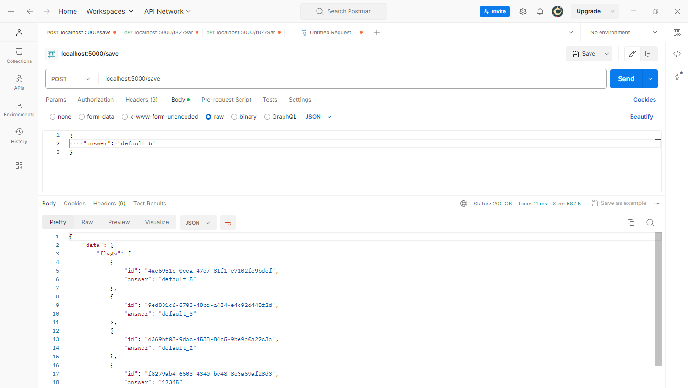

# Implementation of gRPC API and Protobuf in Node JS

## Goals

We will build basic CRUD application using gRPC API and Protobuf in NodeJS.

## Development Steps

### 1. Init Project

1. Clone your github repo in local
    ```bash
    git clone https://github.com/michaelwaynewibisono/UTS_5027221037_Michael-Wayne
    ```

2. Then make project directory
    ```bash
    mkdir gRPC
    mkdir gRPC/back-end
    ```
    Move to the directory
    ```bash
    cd gRPC
    cd back-end
    ```

3. Init node env
    ```bash
    pnpm init
    ```
    Install grpc library
    ```bash
    pnpm install --save @grpc/grpc-js @grpc/proto-loader uuid express hbs body-parser sequelize mysql2 cors
    ```

4. Create 4 files:
    * [Proto file](flags.proto)
    * [Server.js](/back-end/server/server.js)
    * [Client.js](/back-end/client/client.js)
    * [Index file for testing (index.js)](/back-end/client/index.js)

    ```bash
    touch flags.proto server/server.js client/client.js client/index.js
    ```

### 2. Add CRUD Functions

#### a. Proto file
```protobuf
syntax = "proto3";

service FlagService {
    rpc GetAll (Empty) returns (FlagList) {}
    rpc Get (FlagRequestId) returns (Flag) {}
    rpc Insert (Flag) returns (Flag) {}
    rpc Update (Flag) returns (Flag) {}
    rpc Remove (FlagRequestId) returns (Empty) {}
}

message Empty {}

message Flag {
    string id = 1;
    string answer = 2;
}

message FlagList {
    repeated Flag flags = 1;
}

message FlagRequestId {
    string id = 1;
}
```

#### b. Server
Connect database

```js
// use sequelize
const { Sequelize, DataTypes } = require('sequelize');

const sequelize = new Sequelize('crud_grpc', 'root', '', {
    host: 'localhost',
    dialect: 'mysql'
});

const Flag = sequelize.define('Flag',
    {
        id: { type: DataTypes.STRING, primaryKey: true },
        answer: { type: DataTypes.STRING, allowNull: false }
    },
    { tableName: 'flags', timestamps: false });

sequelize.sync()
    .then(() => { console.log('Database synchronized'); })
    .catch(err => { console.error('Database synchronization failed:', err); });
```

Add Service in server.js

```js
// perform crud
server.addService(flagsProto.FlagService.service, {
    getAll: async (_, callback) => {
        const getAllFlags = await Flag.findAll();
        callback(null, { flags: getAllFlags });
    },

    get: async (call, callback) => {
        const flag = await Flag.findByPk(call.request.id)
        if (flag) {
            callback(null, flag);
        } else {
            callback({
                code: grpc.status.NOT_FOUND,
                details: "Not found"
            });
        }
    },

    insert: async (call, callback) => {
        const flag = call.request;

        flag.id = uuidv4();
        const postFlag = await Flag.create(flag);
        callback(null, { flag: postFlag });
    },

    update: async (call, callback) => {
        const existingFlag = await Flag.findByPk(call.request.id);
        if (existingFlag) {
            existingFlag.answer = call.request.answer;
            await existingFlag.save();
            callback(null, existingFlag);
        } else {
            callback({
                code: grpc.status.NOT_FOUND,
                details: "Not found"
            });
        }
    },

    remove: async (call, callback) => {
        const existingFlagIndex = await Flag.findByPk(call.request.id);

        if (existingFlagIndex) {
            await existingFlagIndex.destroy();
            callback(null, {});
        } else {
            callback({
                code: grpc.status.NOT_FOUND,
                details: "Not found"
            });
        }
    }
```

#### c. Main file
We need new js file to test our application, named **index.js**

```js
const client = require("./client");
const cors = require('cors')

const path = require("path");
const express = require("express");
const bodyParser = require("body-parser");

const app = express();

app.use(cors({
    origin: 'http://localhost:3000'
}));

app.use(bodyParser.json());
app.use(bodyParser.urlencoded({ extended: false }));

app.get("/", (req, res) => {
    client.getAll(null, (err, data) => {
        if (!err) res.json({ data })
    });
});

app.get('/:id', (req, res) => {
    client.get({ id: req.params.id }, (err, data) => {
        res.json({ data })
    })
});

app.post("/save", (req, res) => {
    let newFlag = {
        answer: req.body.answer,
    };

    client.insert(newFlag, (err, data) => {
        if (err) throw err;

        console.log("Flag created successfully", data);
        res.redirect("/");
    });
});

app.post("/update", (req, res) => {
    const updateFlag = { id: req.body.id, answer: req.body.answer };

    client.update(updateFlag, (err, data) => {
        try {
            if (data == undefined) {
                console.log("Your Id isn't available")
                res.json("Your Id isn't available")
                return;
            }

            console.log("Flag updated successfully", data);
            res.json({ data })
        } catch (err) { throw err }
    });
});

app.post("/remove", (req, res) => {
    const getId = req.body.id
    client.remove({ id: getId }, (err, _) => {
        try {
            console.log("Flag removed successfully");
            res.json('Id ' + getId + ' deleted successfully')
        } catch (err) { throw err }
    });
});

const PORT = process.env.PORT || 5000;
app.listen(PORT, () => {
    console.log("Server running at port %d", PORT);
});
```


## Testing
Use `nodemon server.js` inside server folder to start the server, and `nodemon client.js` and `nodemon index.js` inside client folder to start the client. Here is the screenshot.


## Requests
Use Postman to perform a GET, POST, PUT, and DELETE requests

1. GET Request


2. GET by ID Request


3. POST Request


4. PUT Request


5. DELETE Request
